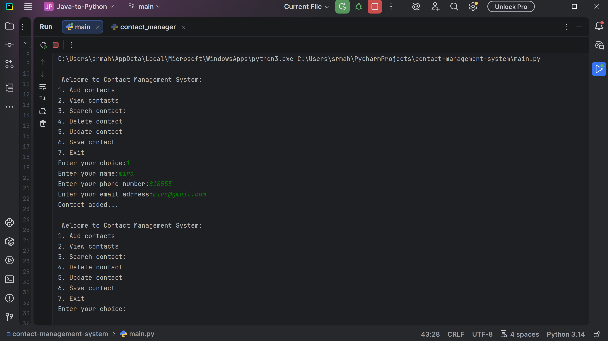
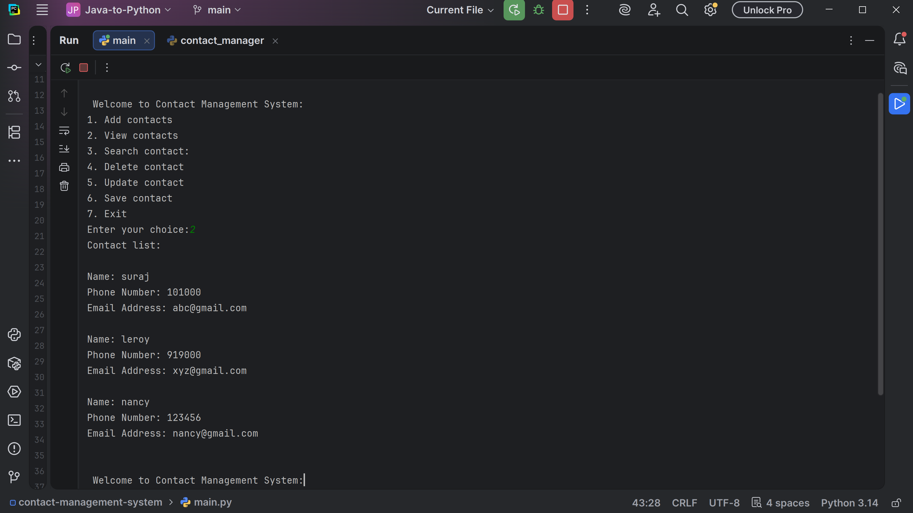
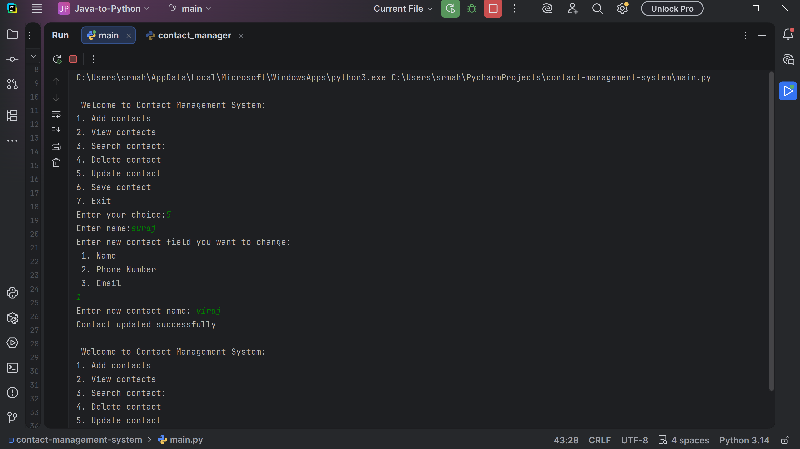

# Contact Management System

## Overview
CLI-based application to manage contacts using Python with JSON persistence.

## Features
- Add, view, search, update, delete contacts
- Data stored in JSON file
- Input validation

## Technologies
- Python
- JSON

## How to Run
1. Run main.py
2. Use menu options

## Example
Add → View → Search → Update → Delete

## Screenshots

